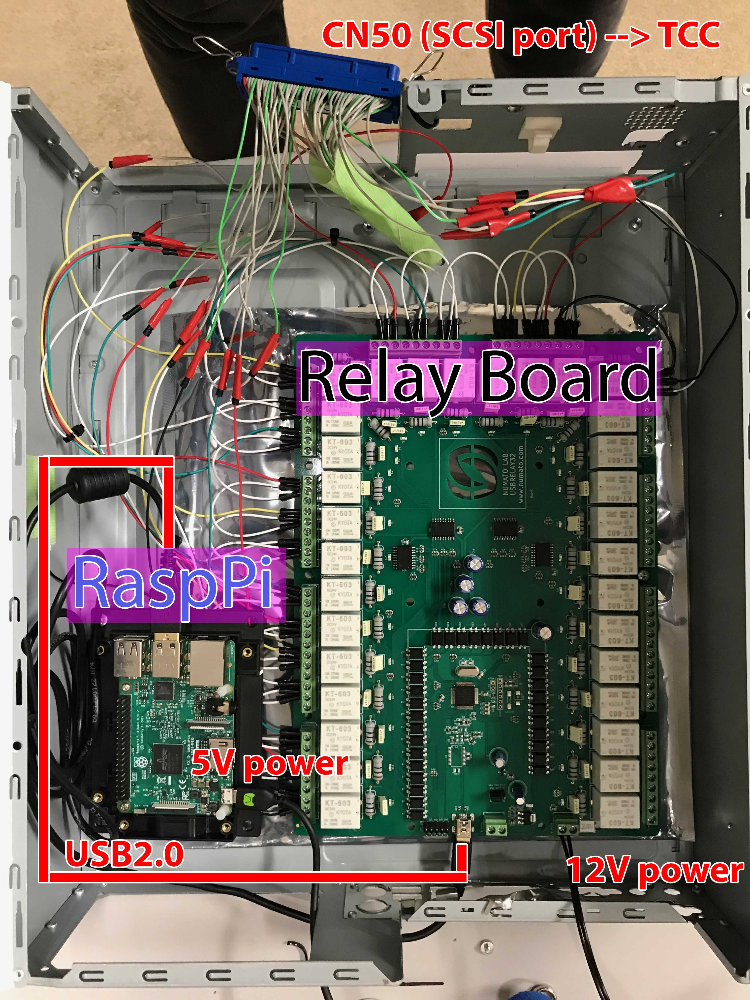

# 時刻サーバーのGPSロールオーバー回避策
timeserver workaround

Timeserver GPS rollover workaround

works with Python 2.7 and 3.xx

Transmits current Year and Day in 4bit binaries to the TCC.

The CN50 (SCSI port) is emulated through a 32 port relay board. The relay board is controlled through usb from a Raspberry Pi 3b.

Dependencies:

- pyserial
- numpy
- datetime
- signal 
